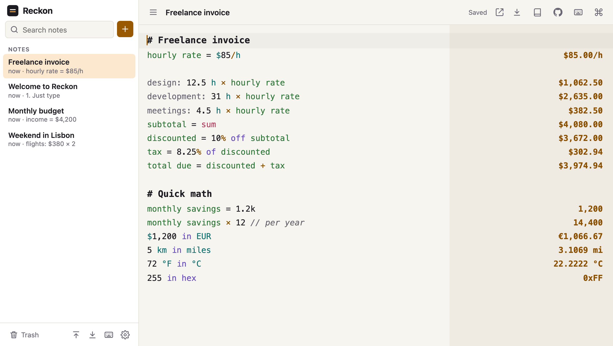

<p align="center">
  <a href="https://parmsam.github.io/reckon/">
    <picture>
      <source media="(prefers-color-scheme: dark)" srcset="docs/logo-dark.svg">
      
    </picture>
  </a>
</p>

<p align="center"><strong>A notepad that does the math.</strong><br>
Type text and numbers naturally, and see the answers line by line.</p>

<p align="center">
  <a href="https://parmsam.github.io/reckon/"><strong>Open Reckon →</strong></a>
</p>

<p align="center">
  <a href="https://github.com/parmsam/reckon/actions/workflows/ci.yml"></a>
  <a href="https://github.com/parmsam/reckon/actions/workflows/deploy.yml"></a>
  <a href="LICENSE"></a>
  
</p>

<p align="center">
  <picture>
    <source media="(prefers-color-scheme: dark)" srcset="docs/screenshot-dark.png">
    
  </picture>
</p>

**[Docs](https://parmsam.github.io/reckon/docs/)** · **[Syntax](https://parmsam.github.io/reckon/docs/#syntax)** · **[Glossary](https://parmsam.github.io/reckon/docs/#glossary)** · **[Units](https://parmsam.github.io/reckon/docs/#units)** · **[For LLMs](https://parmsam.github.io/reckon/llms.txt)**

Reckon is a free, open-source take on notepad calculators like [Numi](https://numi.app) and
[Soulver](https://soulver.app). It runs in any browser, installs as an app, works offline, and keeps your notes on your
own device.

## Features

**Available now**
- **Answers as you type**, aligned beside each line. Click an answer, or press <kbd>⌘/Ctrl</kbd> <kbd>⇧</kbd> <kbd>C</kbd>, to copy it.
- **Natural syntax**: `20% of 50`, `10% off 80`, `5 as % of 20`, `3 apples + 2 apples`
- **Variables and references**: `hourly rate = 85`, `prev`, `line3`, `sum`, `avg`, `count`, `min`, `max`
- **Units**: `5 km in miles`, `60 mph in km/h`, `6 ft 2 in in cm`, `72 °F in °C`, `1 GiB in MB`, `2 cups in ml`, CSS `12pt in px`
- **Currencies and crypto**: `$30 in EUR`, `€20 + $5`, `0.01 BTC in USD`, with rates cached for offline use
- **Units that cancel**: `hourly rate = $85/h`, then `12.5 h × hourly rate` is `$1,062.50`
- **Dates and time zones**: `today + 2 weeks`, `days until Dec 25`, `next friday at 3pm`, `3pm PST in London`, `time in Tokyo`
- **Conditions and comparisons**: `if total > $100 then 10% off total else total`, `5 km > 3 miles`, `and`/`or`/`not`, bitwise `& | xor << >>`
- **Your own functions and units**: `tip(bill, rate) = bill × rate`, `1 sprint = 2 weeks`, even a metric `1 cup = 250 ml`
- **Precise decimals**: `0.1 + 0.2` is `0.3`, not `0.30000000000000004`
- **Many notes** with search, pinning, trash and undo
- **Share links**: the note is compressed into the URL itself, so no server ever sees it
- **Export with answers** as aligned text, Markdown tables or a printable web page
- **Backup and restore** as JSON, plus import of `.txt` and `.md` files
- **Syncs between open tabs** and works offline once loaded
- **Command palette** (<kbd>⌘/Ctrl</kbd> <kbd>K</kbd>), **autocomplete** for variables, units and functions, and a
  row of math keys above the phone keyboard
- **Settings**: theme, font size, number format, decimal places, angle unit, and a switch that turns off all network requests
- **Light and dark themes**, a phone layout, and screen reader support

**For developers and AI** (see the [docs](https://parmsam.github.io/reckon/docs/#links-that-open-a-note))
- **Links that open a note**: `…/reckon/#/new?text=<percent-encoded note>`, easy for any LLM or script to write
- **[engine.js](https://parmsam.github.io/reckon/engine.js)**: the calculation engine as one ES module, `evaluate(note)` in Node, Deno or a browser
- **[llms.txt](https://parmsam.github.io/reckon/llms.txt)**, **[a prompt](https://parmsam.github.io/reckon/prompt.txt)** that makes any chat assistant answer with a clickable Reckon link, and an **[agent skill](skills/reckon/SKILL.md)**

## Syntax at a glance

| What | Examples |
|---|---|
| Numbers | `1,000` · `1_000` · `1.5e3` · `1.5k` · `2M` · `3bn` · `2 million` · `0xFF` · `0b1010` · `½` |
| Operators | `+ - * / ^ mod !` · `× ÷ −` · `plus`, `times`, `divided by` · `3 x 4` · `2(3 + 4)` · `2pi` |
| Percentages | `20% of 50` · `50 + 10%` · `10% off 50` · `10% on 50` · `5 as % of 20` · `5 is what % of 20` · `20% of what is 5` |
| Variables | `rent = 1,200` · multi-word names: `monthly rent * 12` |
| References | `prev` / `ans` (last answer) · `line3` (answer on line 3) |
| Totals | `sum` / `total` · `avg` · `count` · `min` · `max` (each covers the lines since the last heading or blank line) |
| Functions | `sqrt` · `cbrt` · `root(x, n)` · `round(x, 2)` · `floor` · `ceil` · `abs` · `sin` / `cos` / `tan` (degrees) · `log` · `ln` · `exp` · `fact` |
| Constants | `pi` / `π` · `e` · `tau` · `phi` |
| Output formats | `255 in hex` · `10 in binary` · `8 as oct` · `1500 in sci` |
| Units | `5 km in miles` · `1 m + 20 cm` · `60 km/h in m/s` · `3 m × 4 m` · `sqrt(16 m²)` · `1/2 cup` · `5' 10"` · `1 h 30 min` · `100 °C in °F` · `1 GB in MiB` · `24px in pt` |
| Dates | `today` · `tomorrow at 9am` · `next friday` · `Dec 25` · `2026-07-04` · `today + 2 weeks` · `Jan 31 + 1 month` · `Dec 25 - today` · `days until Dec 25` · `3 days ago` · `in 45 min` |
| Times and zones | `3pm` · `15:45` · `noon` · `3pm + 90 min` · `5pm - 3pm` · `now in Tokyo` · `time in New York` · `3pm PST in London` · `9:00 EST to CET` · `3pm in UTC+5:30` |
| Currency | `$30` · `€20 + $5` · `100 GBP to yen` · `20 canadian dollars in USD` · `0.5 BTC in USD` · `100k sats in USD` · `$85/h × 37.5 h` |
| Structure | `# Heading` · `// comment` · `label: 42` (text before a colon is ignored) |

A line Reckon can't make sense of shows no answer, never a wrong one.

## Keyboard shortcuts

| Shortcut | Action |
|---|---|
| <kbd>⌘/Ctrl</kbd> <kbd>K</kbd> | Command palette: every action, plus jump to any note |
| <kbd>⌘/Ctrl</kbd> <kbd>⇧</kbd> <kbd>C</kbd> | Copy the answer on the current line |
| <kbd>⌘/Ctrl</kbd> <kbd>/</kbd> | Comment or uncomment lines |
| <kbd>⌘/Ctrl</kbd> <kbd>F</kbd> | Find and replace |
| <kbd>Tab</kbd> | Accept an autocomplete suggestion (<kbd>Ctrl</kbd> <kbd>Space</kbd> to ask for one) |
| <kbd>?</kbd> | Show all shortcuts (also the keyboard button in the notes list) |

## Your data
- Notes are stored in your browser (IndexedDB). There are no accounts, no servers and no analytics.
- The only network requests fetch exchange rates (open.er-api.com, falling back to Frankfurter; CoinGecko only if a
  note mentions crypto). They never include your notes, and you can turn them off in Settings.
- Clearing site data deletes your notes, so use **Export all notes** (sidebar footer) for a backup.
- A share link holds the whole note in the part of the URL after `#`, which browsers never send to a server.

## Development
Requires Node 22+.

```sh
npm install
npm run dev          # http://localhost:5173/reckon/
npm test             # unit and golden tests (Vitest)
npm run test:e2e     # browser tests (Playwright, desktop and mobile)
npm run lint && npm run typecheck
npm run screenshots  # regenerate the README screenshots
node scripts/smoke-engine.mjs  # check dist/engine.js after a build
```

Every push to `main` runs CI and deploys to GitHub Pages.

- [PLAN.md](PLAN.md) has the product spec, full syntax reference and roadmap.
- [AGENTS.md](AGENTS.md) covers project structure, conventions and how-to recipes (adding a unit, a function, or new syntax).

Built with TypeScript, Vite, CodeMirror 6, decimal.js, Temporal (with `temporal-polyfill`), IndexedDB (via `idb`) and vite-plugin-pwa. Exchange rates
come from [ExchangeRate-API](https://www.exchangerate-api.com), [Frankfurter](https://frankfurter.dev) and
[CoinGecko](https://www.coingecko.com).

## How Reckon compares
Reckon builds on ideas from these notepad calculators. Details come from each project's site or repo as of
October 2026. "See site" means we didn't confirm the detail.

| App | Platforms | Open source | Price | Ideas Reckon borrows |
|---|---|---|---|---|
| **Reckon** | Any browser; installable PWA | ✅ [MIT](LICENSE) | Free | Works offline, stores everything locally, shares notes by link |
| [Numi](https://numi.app) | macOS, Windows, Linux CLI, Alfred | CLI only ([repo](https://github.com/nikolaeu/numi)) | See site | Natural phrases (`$20 in euro - 5% discount`), `#` headers, `prev`/`sum`/`avg`, CSS units, JS extensions |
| [numbr](https://numbr.dev) | Web, Chrome extension | ✅ ([repo](https://github.com/antonmedv/numbr)) | Free | TypeScript parser/evaluator split, share by URL, `k`/`M` suffixes, ignores surrounding text |
| [Soulver](https://soulver.app) | macOS, iOS, iPadOS | ❌ | Paid | Live line references, subtotals and totals, multi-word variables, percentage phrasing, calendar math |
| [Parsify](https://parsify.app) | macOS, Windows, web | ❌ | Free (5 lines) or €30 one-time | Over 200 currencies with hourly rates, time zones, plugins, theming |
| [Notes Calculator](https://notescalculator.com) | Mac, Windows, Linux, iOS, Android, web | ❌ | One free note; lifetime purchase for more | Large-number shorthand, hex/binary, conditionals, offline-first |
| [Antinote](https://antinote.io) | macOS | ❌ | See site | Scratchpad feel, `sum`/`average`/`count`, reactive variables, local-only privacy |
| [Calcator](https://calcator.app) | macOS, Windows, Linux | See site | Free | Variable autocomplete, multi-cursor editing, number-format settings, tabs |
| [Ganaka](https://github.com/spdeepak/Ganaka) | macOS 14+ | ✅ | Free | `$1`/`$last` line refs, `min`/`max`/`count`, Unicode `× ÷ −`, tabbed workspaces |
| [Figr](https://www.figr.app) | See site | See site | See site | The minimal notepad-calculator framing |

Thanks to all of them for the inspiration. PLAN.md §2 has a longer breakdown, including what Reckon avoids.

## License
Reckon is released under the [MIT License](LICENSE). © 2026 Sam Parmar.
